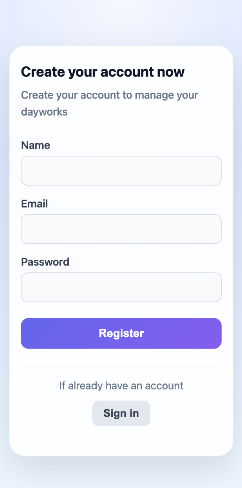

# Multi-User Todo Application

A full-stack multi-user Todo application built using React, Node.js, Express, PostgreSQL, and JWT authentication.

The application allows users to register, log in securely, and manage personal todos with protected API routes and persistent database storage.

---

# Live Demo

[View App](https://ak-todo-app.vercel.app)

---

# Features

- User registration and login
- JWT authentication
- Protected routes
- Create todos
- Mark todos as completed
- Delete completed todos
- PostgreSQL database integration
- Responsive modern UI
- Multi-user support

---

# Tech Stack

## Frontend
- React
- React Router DOM
- Context API
- CSS

## Backend
- Node.js
- Express.js
- JWT Authentication
- bcrypt

## Database
- PostgreSQL (Neon)

## Deployment
- Vercel (Frontend)
- Render (Backend)
- Neon (Database)

---

# Project Structure

```bash
client/
server/
```

---

# Architecture

Frontend and backend are separated into independent applications.

## Frontend
- Handles UI rendering
- Stores JWT token in localStorage
- Sends authenticated requests
- Manages protected routes

## Backend
- Handles authentication and authorization
- Verifies JWT tokens
- Manages todo CRUD operations
- Connects to PostgreSQL database

## Database
- Stores users and todos
- Todos are linked to authenticated users

---

# Authentication Flow

1. User registers or logs in
2. Server validates credentials
3. JWT token is generated
4. Token is stored in localStorage
5. Protected routes require Bearer token authorization

---

# Installation

## Clone Repository

```bash
git clone https://github.com/your-username/todo-app.git
cd todo-app
```

---

# Backend Setup

```bash
cd server
npm install
```

Create a `.env` file inside the `server` folder:

```env
PORT=3003
JWT_SECRET=your_jwt_secret
DATABASE_URL=your_neon_database_url
```

Run backend server:

```bash
npm start
```

Backend runs on:

```bash
http://localhost:3003
```

---

# Frontend Setup

```bash
cd client
npm install
```

Create a `.env.development` file inside the `client` folder:

```env
HOST=0.0.0.0
REACT_APP_SERVER_URL=http://localhost:3003
```

Run frontend:

```bash
npm start
```

Frontend runs on:

```bash
http://localhost:3000
```

---

# API Endpoints

## Authentication

### Register
```http
POST /auth/register
```

### Login
```http
POST /auth/login
```

---

## Todos

### Get Todos
```http
GET /todos/get
```

### Add Todo
```http
POST /todos/add
```

### Update Todo Status
```http
PUT /todos/check
```

### Delete Completed Todos
```http
DELETE /todos/delete
```

---

# Security

- Passwords are hashed using bcrypt
- JWT tokens are used for authentication
- Protected API routes
- User-specific todo access control

---

# Screenshots

## Register Page


## Login Page


## Todo Page


---

# Future Improvements

- Refresh token authentication
- Dark mode
- User profile settings

---

# Author

**Arsen Karapetyan**