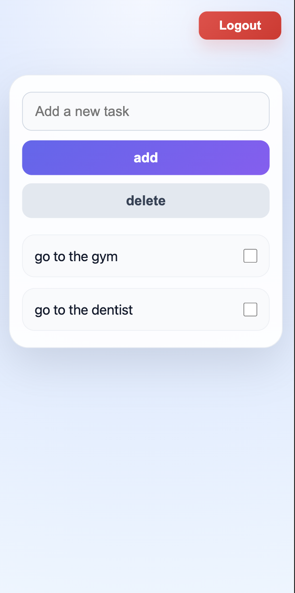

# Multi-User Todo Application

A full-stack multi-user todo application built using React, Node.js, Express, PostgreSQL, and JWT authentication.

## Features

- User registration and login
- JWT authentication
- Protected routes
- Create, update, and delete todos
- PostgreSQL database integration
- Responsive frontend UI

---

## Tech Stack

### Frontend
- React
- React Router
- Context API
- CSS

### Backend
- Node.js
- Express.js
- JWT Authentication
- bcrypt

### Database
- PostgreSQL

---

## Project Structure

```bash
client/
server/
```

## Architecture

Frontend and backend are separated into independent applications.

- React frontend handles UI and authentication state
- Express API handles business logic
- PostgreSQL stores users and todos
- JWT tokens secure protected routes


## Authentication Flow

1. User registers or logs in
2. Server validates credentials
3. JWT token is generated
4. Token is stored in localStorage
5. Protected routes require Bearer token authorization

---

## Installation

### Clone Repository

```bash
git clone https://github.com/.....
cd todo-app
```

---

## Backend Setup

```bash
cd server
npm install
```

Create `.env` file:

```env
PORT=3003
JWT_SECRET=your_jwt_secret
DATABASE_URL=your_postgresql_connection
```

Run backend:

```bash
npm start
```

---

## Frontend Setup

```bash
cd client
npm install
```

Create `.env.development` file:

```env
HOST=0.0.0.0
REACT_APP_SERVER_URL=http://localhost:3003
```

Run frontend:

```bash
npm start
```

---

## API Endpoints

### Authentication

- POST `/auth/register`
- POST `/auth/login`

### Todos

- GET /todos/get
- POST /todos/add
- PUT /todos/check
- DELETE /todos/delete

---

## Screenshots




---

## Future Improvements

- Docker support
- Task filtering
- Due dates
- Dark mode
- Refresh token authentication

---

## Author

Arsen Karapetyan# todo-app
